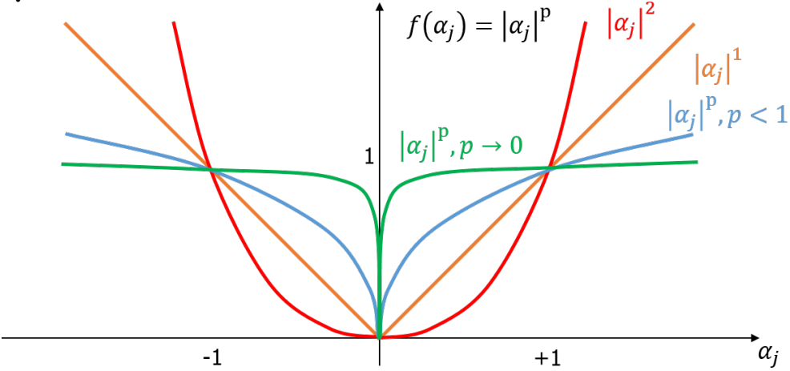

# Week 6 - Sparse Coding and Regularization

## Sparse Coding

In dictionry learning, we have:
$$\underset{D \in \mathcal{D}, R \in \mathcal{R}}{\operatorname{\argmin}}||X-DR||_F^2$$

Can we learn new sparse representation of the original data?

### $l_p$ norm
$$||\alpha||_p=(\sum_{j=1}^k|\alpha_j|^p)^{1/p}$$
where $\alpha \in \mathbb{R}^k$.

**$l_0$ norm.** counts the non zero elements. e.g. $||[2,3,1,0,0]||_0=3$

**$l_1$ norm.** is the sum of the absolute values. e.g. $||[2,3,1,0,0]||_1=6$

### K-means
Each column of $R$ is a one-hot vector. So that $||R_i||_0=1$ and $||R_i||_1=1$

## Sparse Coding Application

### K_SVD
$$||R_i||_0\le k' << k$$

Calculate the sparse representation after uniform slicing.

Can be used to:
- Copression
- Inpainting

## Measure of Sparsity
The objective function:
$$\underset{D \in \mathcal{D}, R \in \mathcal{R}}{\operatorname{\argmin}}||X-DR||_F^2 + \lambda \psi(R)$$
where $\psi$ is used to determine the sparsity of $R$.

We can use $l_0$ norm to measure sparsity.

## Regularization and Algorithmic Stability
A learning algorithm is said to be stable if slight perturbations in the training data result in small changes in the output of the algorithm, and these changes vanish as the data set grows bigger and bigger.

> For two training sets:
> $$S=\{(X_1,Y_1),...,(X_i,Y_i),...(X_n,Y_n)\}$$
> $$S^i=\{(X_1,Y_1),...,(X_i',Y_i'),...(X_n,Y_n)\}$$
> An algorithm is uniformly stabel if for any sample $(X,Y)$:
> $$|l(X,Y,h_S)-l(X,Y,h_{S^i})| \le \epsilon(n)$$

