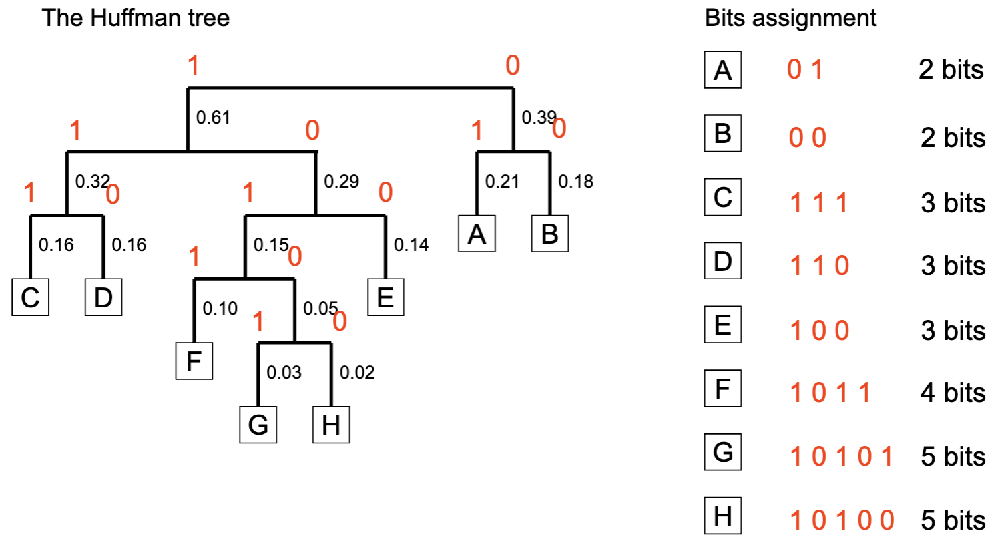
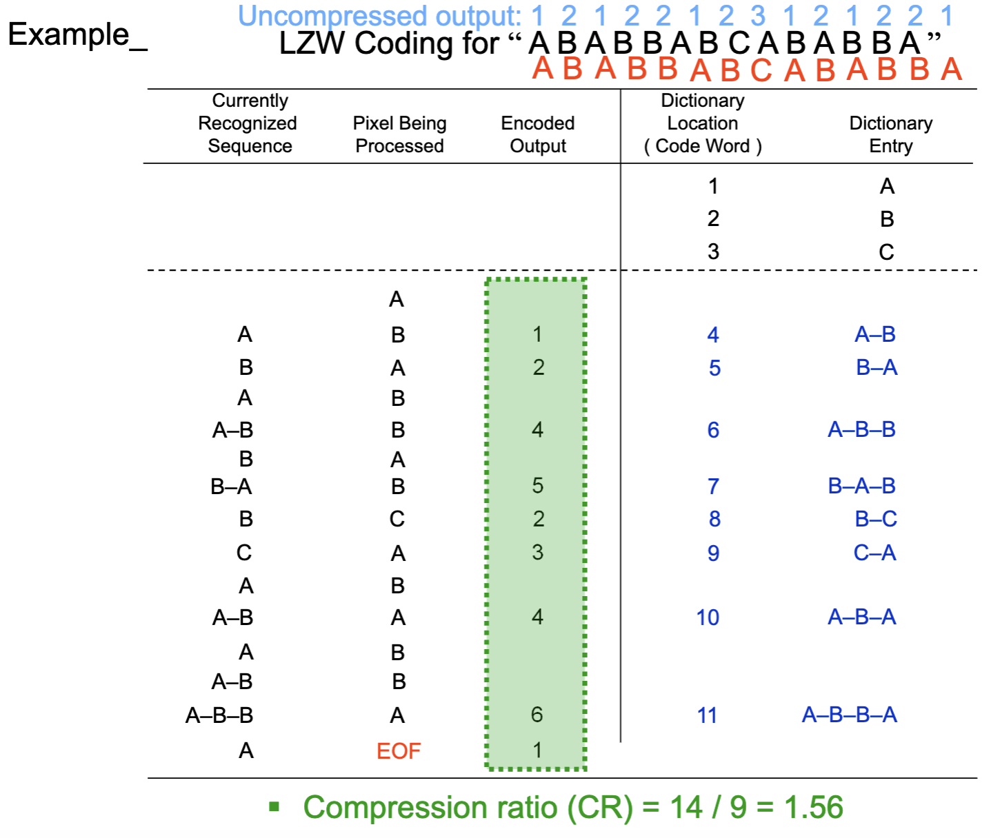

# Week 10 - Digital Media Compression

## Data Redundancy

$$R_D=1-1/C_R$$
where $C_R$ is the compression ratio:
$$C_R=n_1/n_2$$

### Coding redundancy

### Spatial and temporal redundancy

### Psycho-vidual/acoustic redundancy 

Information can't received by human.

- Lossless compression
- Lossy compression

### Huffman Coding

### LZW Coding

Normally people set a fixed dictionary size.

### Transform Coding

### Standards and Formats

## JPEG Compression

### Colour Conversion

$$Y=0.3R+0.6G+0.1B \\ U=B-Y \\ V=R-Y$$

### DCT Conversion

Using blocks.w
