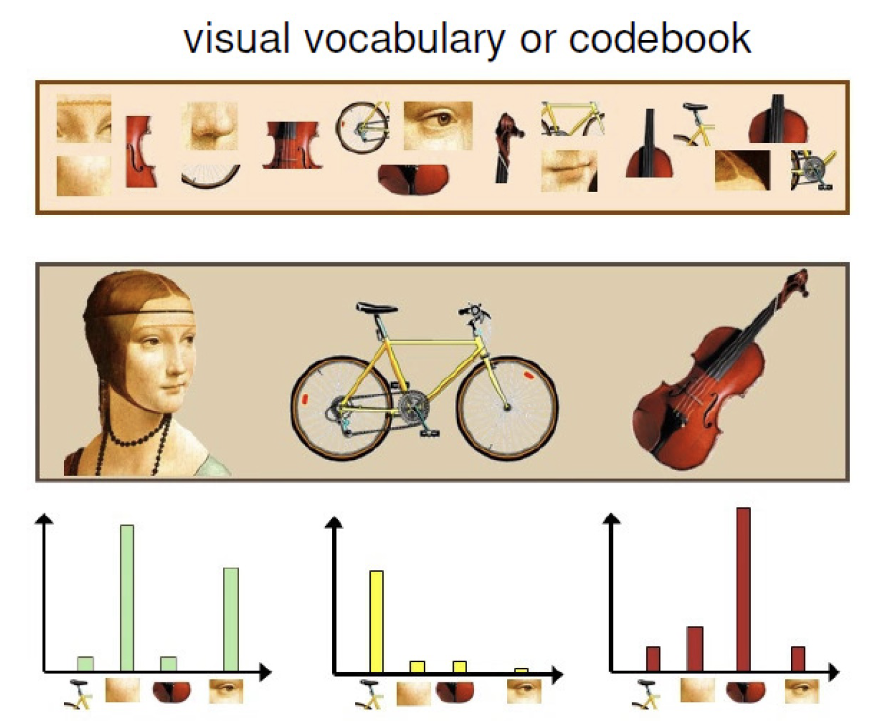

# Week5 - Digital Image Understanding

Challenges:
- View point variation
- Illumination
- Occlusion
- Scale
- Deformation
- Background clutter
- Intra-calss variation

## Representation

Appearance only or appearance with location.

Bag-of-Feature: Count features and compare the amount of features.

Invariances:
- View point
- Illumination
- Occlusion
- Scale
- Deformation
- Clutter

Use set of features or each pixel in image.

## Learning

- Training methods
  - Generative
  - Discriminative
- Level of supervision
  - Bounding box
  - Image labels
  - Manual segmentation
- Priors

## Object Recognition

