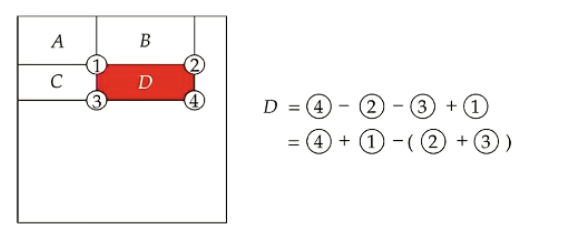

# Week 6 - Object Detection and Action Recognition

Applications: Autonomous vehicles, Surveillance systems, Robotics, Image search engines, etc.

## Bounding Box Level

### Viola Jones (VJ) Detector

Steps:
1. Sliding windows.
2. Determine whether each sliding window contains the object of interest.

Haar features:

1. The eye is darker than the forehead.
2. The bridge of the nose is brighter than the sides.

$$ \begin{bmatrix}
    1&5\\
    1&5\\
\end{bmatrix}\rightarrow2-10=-8$$ 

3. Integral image - Using cumulative brightness. (To speed up calculation)

AdaBoost

### Histogram of Oriented Gradient (HOG)

- Image normalization
  - grayscale, gamma correction
  - Resize
- HOG descriptor
  - Compute gradients
    - Change in X direction
    - Change in Y direction
- Linear SVM

### R-CNN

#### Region Proposal

1. Initialize regions
2. Calculate the similarity
   1. Color similarity
   2. Texture similarity
   3. Size similarity
   4. Shape compatibility
3. Merge the regions

### Fast R-CNN
Propose region Interest to reducte the number of CNN.

- Classification loss
- Bounding-box regression offsets

### You Only Look Once (YOLO)

- Input image
- Divide the image into a grid
- Candidate bounding boses
- Non-maximum suppression

DarkNet as the backbone

## Human Action Recognition

Decides the action category of a given video clip.

