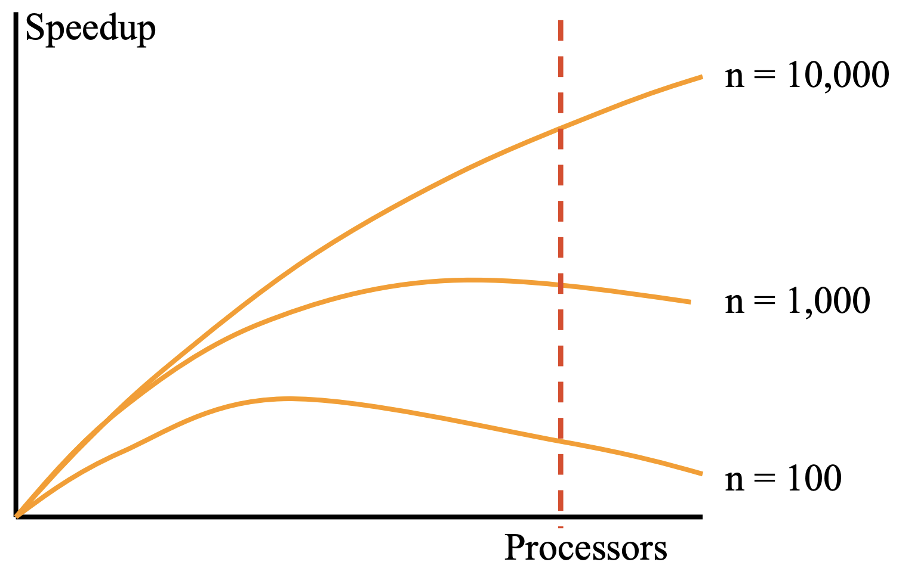

# Week 10 - Scalability of Parallel Systems

## Performance Analysis

For sequential program, the runtime is related to the input size.

For parallel program, the runtime is realted to:
- The input size
- The num of process
- The communication parameters

## Scalability Analysis

- Predict the performance for large number processors from known performance on fewer processors.
- For fixed, determining the optimal number of processors to achieve maximum speedup.

Factors affect the speedup:
- A

**Total Time**  is defined as follow:
$$T_{all} = p T_p$$ 
By using thism, the **speedup** can be rewritten as:
$$S=\frac{pT_s}{T_s+T_o}=\frac{p}{1+\frac{T_o}{T_s}}$$

Similarly, **efficiency** can be rewritten as:
$$E=\frac{T_s}{T_{all}}=\frac{1}{1+\frac{T_o}{T_s}}$$

We can see if $T_o \downarrow$, speedup and efficiency $\uparrow$.

### Granuarity

## Workload Scaling Model

### Fixed-load Model

#### Gustafson's Law

### Fixed-time Model

#### Gustafson's Law

$$W'=\alpha W+p(1-\alpha) W$$
where $W$ is the workload. $\alpha$ is the sequential fraction of the program.

For parallel program, $T_p=W$, and for the sequential program, $T_s=\alpha W+p(1-\alpha) W$. The fixed speedup is:
$$S=p-\alpha (p-1)$$ 

