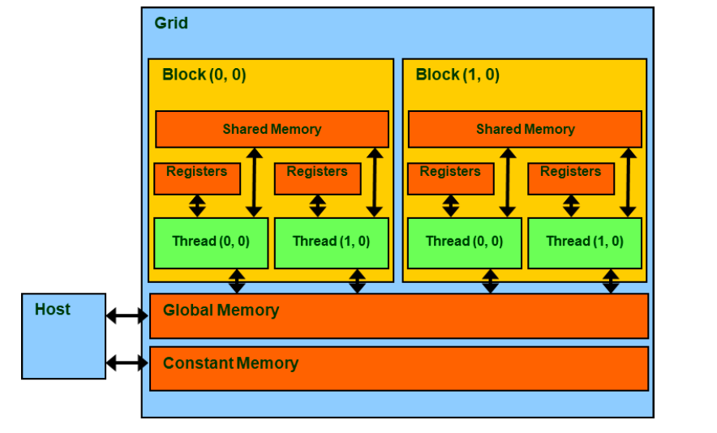

# Week 11 - GPU Programming

## Structure of GPU

RTX 4090

- Streaming multipocessor
  - 128 cores
  - 16MB of shared memory
  - 32MB register file
  - 4 tensor cores for machine learning
- 128SMs, 16384 cores, 512 tensor cores and 72MB L2 cache in total


## CUDA Execution Model

Serial parts in host C code, parallel parts in device kernel code.

Execute same kernel code.

```C++
#include<cuda.h>
void vecAdd(A,B,C){
    //Allocate device memory for A, B, and C

    //Kernel launch code

    //Copy C from the device memory
}
```

A CUDA kernel is executed by a grid (array) of threads.
- All threads in a grid run the same kernel code (single program multiple data).
- A thread array is divided into multiple blocks, which are distributed to different SMs.
- Threads within a block cooperate via shared memory, atomic operations and barrier synchronisation. (Smaller but Faster)
- Block id and thread id in one block.
  - `i=blockIdx.x*blockDim.x+threadIdx.x`


Structure:
- CUDA kernel 
  - A grid of threads
- SM 
  - 8-12 blocks/SM
  - Able to handel a certain number of threas  
- Block 
  - 32-thread warps
  - User defined block size
- Warp 
  - Basic scheduling units in SM
- Threads 
  - Run in SIMD

## CUDA Memories



- Registers - per thread
- Shared memory - per block
- Global memory - all threads
- `cudaMalloc()` allocate an object in the device global memory.
- `cudaMemcpy()` transfer data between device and host.

Global memory is much more slower than execution rate.

### Multiple DRAM Banks

Signal need to be decoded to find the specific row.

Burst mode: The system will output a set of consecutive data items (chche line).

The address space is partitioned into burst sections.

### Memory Coalescing

Access data in one row. In CUDA, each threads should access in column major order.

### Shared Memory

Shared memory can only be accessed by the threads in the same block.

