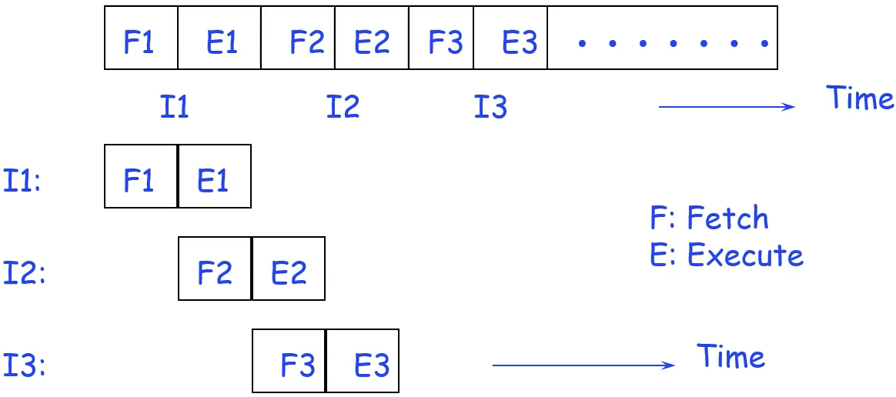
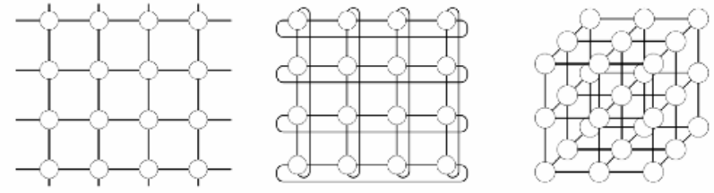
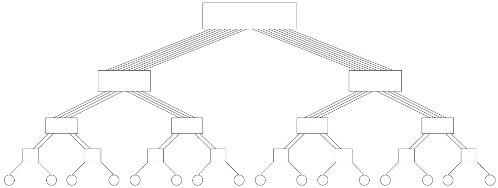

# Week 2 - Aprallel Architectures

## Implicit Parallelism

### Pipelining

Limitations:

- The speed of a pipeline is limited by the slowest stage. - Need deep pipelines。
- Conditional jump

### Superscalar

Limination:

- Limited amount of instruction-level parallelism.
- Disptcher and dependency checking cost time.

### Issues of dependency

- True data dependency
- Resource dependency
- Branch dependency

## Interconnection Networks

### Static networks

#### Completely Connected

The number of links is $O(p^2)$. Not scaleable.

#### Linear Arrays, Meshes

### Dynamic networks

#### Buses

All processors access a common bus for exchanging data. However, the bandwidth of the shared bus is a major bottleneck.

#### Tree-Based Networks

The maximum distance is $2logp$.

Fat Tree

Higher node have wider band with.

#### Crossbar

Not scaleable.

#### Multistage - Butterfly

There are $p(logp+1)$ switches.

Use binary to find the route. For example, $6_{10}=110_2$. If the number is 0, go left, otherwith, go right.

## Evaluation Metrics

- Diameter: the distance between the farthest two nodes in the network.
- Arc Connectivity: the minimum umber of links that must be removed to break it inot two network.
- Bisection Width
- Cost: the number of links.
