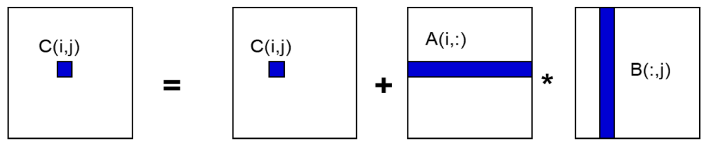
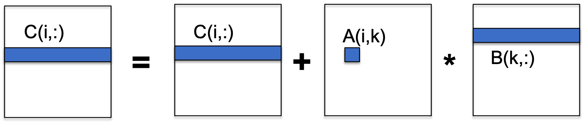
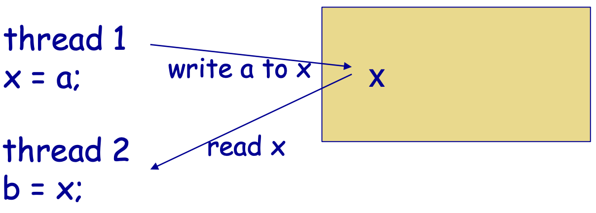

# Week 3 - Computer Classification and Performance Optimisation on Single-Core Systems

## Computer Classification

### SIMD

A single instruction can operate on multiple data elements in parallel.

#### MIMD

Contain both shared-memory anbd distributed-memory architectures.

## Memory Hierarchy

register - local L1 - local L2 - shared L3 - main memory - secondary memory

- Save values in small and fast memory and reuse them.
- Get chunk of contiguous data into cache and use whole chunk.

## Computatiohnal Intensity

The minimum possible calculation time is $f \times t_f$ whenb all data in fast memory. However, the actual time is:
$$T = f \times t_f + m \times t_m $$

$q = f/m$ is computational intensity.

We want to have more data we used stored in fast memory to have higher computational intensity.

## Optimisation

Given the problem of matrix multiplication.

```C++
for(i=0;i<n;i++>){
    for(j=0;j<n;j++){
        for(k=0;k<n;k++){
            C[i][j]=C[i][j]+A[i][k]*B[k][j];
        }
    }
}
```

In this case, we read B with $n^3$ (each column for n times), A with $n^2$ (read each row) and C with $2n^2$ (read and write each element in C). Therefore, we have,
$$m=n^3+n^2+2n^2$$
$$f=2n^3$$
$$q=f/m \approx 2$$

### Contiguous Memory Access

```C++
for(i=0;i<n;i++>){
    for(k=0;k<n;k++){
        for(j=0;j<n;j++){
            C[i][j]=C[i][j]+A[i][k]*B[k][j];
        }
    }
}
```

In this case, if we assume the cache size is $L$, we only need $n/L$ slow memory references to access each row.
$$m=n^2/L+n^3/L+2n^2/L$$
$$q=f/m \approx 2L > 2$$

### Blocking Technique

By blocking, we can divide data into blocks which can be stored in the cache.

Consider we have block size of $b$, the matrix can bivided into $N=\frac{n}{b}$ blocks.

$$m=N*n^2+N*n^2+2n^2$$
$$q=\frac{f}{m} \approx \frac{n}{N} = b$$

### Loop Unrolling

- Reduce instructions that control the loop.
- Efficient use of multiple registers. (load data once and use it in loop for many times)

```C++
for(i=0;i<n;i++>){
    for(k=0;k<n;k+=4){
        a0 = A[i][k];
        a1 = A[i][k+1];
        a2 = A[i][k+2];
        a3 = A[i][k+3];
        for(j=0;j<n;j++){
            C[i][j]=C[i][j]+a0*B[k][j];
            C[i][j]=C[i][j]+a1*B[k+1][j];
            C[i][j]=C[i][j]+a2*B[k+2][j];
            C[i][j]=C[i][j]+a3*B[k+3][j];
        }
    }
}
```

## Parallel Programming Models

There are three kinds of parallel computers:

### Shared-memory machine

Two threads can simultaneously read same data, but can't write data simultaneously.



Explicit synchronization is needed to ensure the value of b will be equal to the value of a.

### Distributed-memory machine

No shared memory in this kind of machine. (need explicitly using send and receive primitives)


### Accelerator

All processing nodes execute the same instruction.