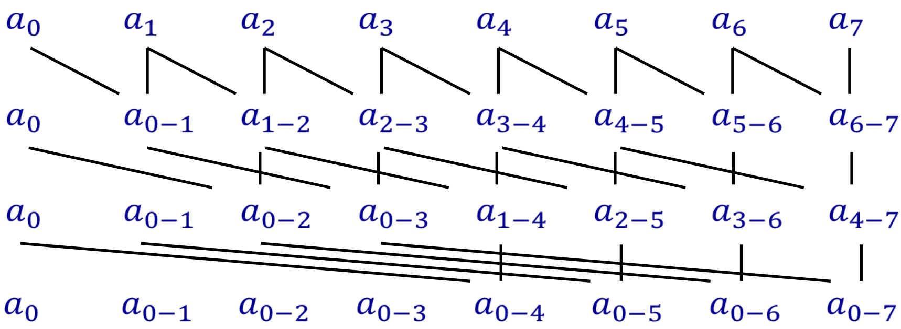
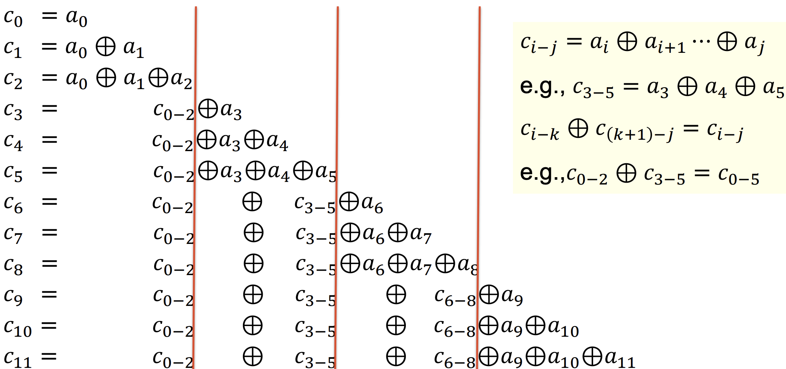

# Week 5 - Parallel Algorithm Design for Shared-Memory Machines

## Matrix Multiplication

### 1D Cyclic

To calculate one row in C, we need to use the whole matrix of B.

### 2D Block

Each time only need three small blocks. Thus they can fit into the cache to minimize cache misses

## Scan Operation

```C++
for(i=1;i<n;i++){
    c[i]=c[i-1]+a[i]
}
```

### Naive Parallel Algorithm



- Time complexity (number of parallel steps): $logn$
- Total number of operations: $nlogn$

However, sequential algorithm only takes $n-1$ operations.

### More Efficient Parallel Algorithm



1. Each thread calculate $n/t$ elements. $W[0,c_{0-2},c_{3-5},c_{6-8}]$
2. A single thread perform scan operation on W. $W[0,c_{0-2},c_{0-5},c_{0-8}]$
3. Each thread add partial scan element.

Analysis
- Time complexity: $\frac{2n}{t}$
  - First step: $b-1=\frac{n}{t}-1$
  - Second step: $t-2$
  - Third step: $\frac{n}{t}$
- Speedup: $S \approx \frac{n}{\frac{2n}{t}}=\frac{t}{2}$
- Efficiency: $0.5$