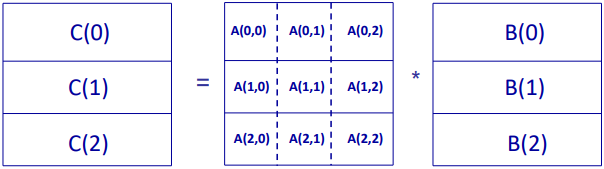
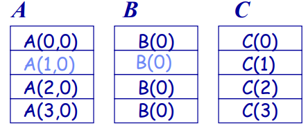

# Week 6 - Parallel Algorithm Design for Distributed-Memory Machines

There is no global memory in distributed memory machines, therefore all data need to be partitioned. We need to concern that:
- How to particition data?
- How to balance the work load?
- How to minimize the communication?

Different from shared memory machine, for matrix multiplication problem, we also need to partition matrixs A and B.

## 1D Array/Ring

Assume we have these two matrix.
$$A=\begin{bmatrix}
    a_{00}&a_{01}&a_{02}&a_{03}&a_{04}&a_{05}\\
    a_{10}&a_{11}&a_{12}&a_{13}&a_{14}&a_{15}\\
    a_{20}&a_{21}&a_{22}&a_{23}&a_{24}&a_{25}\\
    a_{30}&a_{31}&a_{32}&a_{33}&a_{34}&a_{35}\\
    a_{40}&a_{41}&a_{42}&a_{43}&a_{44}&a_{45}\\
    a_{50}&a_{51}&a_{52}&a_{53}&a_{54}&a_{55}
\end{bmatrix}$$
$$
B=\begin{bmatrix}
    b_{00}&b_{01}&b_{02}&b_{03}&b_{04}&b_{05}\\
    b_{10}&b_{11}&b_{12}&b_{13}&b_{14}&b_{15}\\
    b_{20}&b_{21}&b_{22}&b_{23}&b_{24}&b_{25}\\
    b_{30}&b_{31}&b_{32}&b_{33}&b_{34}&b_{35}\\
    b_{40}&b_{41}&b_{42}&b_{43}&b_{44}&b_{45}\\
    b_{50}&b_{51}&b_{52}&b_{53}&b_{54}&b_{55}
\end{bmatrix}$$

First step:

$$\begin{bmatrix}
    a_{00}&a_{01}\\
    a_{10}&a_{11}
\end{bmatrix} * 
\begin{bmatrix}
     b_{00}&b_{01}&b_{02}&b_{03}&b_{04}&b_{05}\\
    b_{10}&b_{11}&b_{12}&b_{13}&b_{14}&b_{15}
\end{bmatrix}$$
