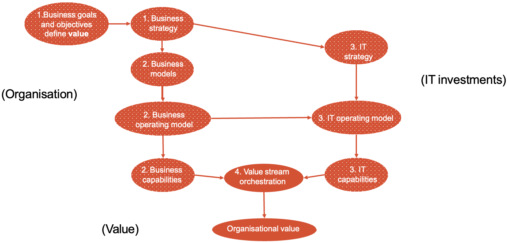
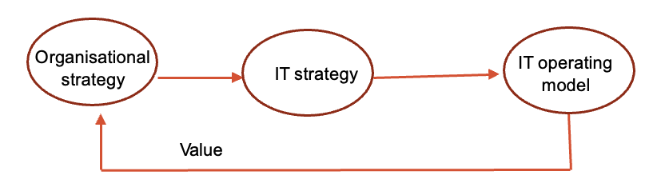

#  Administration

# Week 1
## Lecture
### Professions and practice
Profession:
- qualifications and certification (Not in IT)
- knowledge and skill standards
- common body of knowledge
- ethical standards

### Nature of the IT industry
### Professionalism

## Reading
### [17 ways technology could change the world by 2025](https://www.weforum.org/agenda/2020/06/17-predictions-for-our-world-in-2025/)

# Week 2
## Lecture

### Four Foundational Concepts
- Organizations (profit or non-profit)
  - Structure
    - top down
    - networked (e.g. Alibaba)
- Value
- Organizational Value
- IT Investments
  - **Resources** refer to what an organization owns. It can be tangible or intangible.
  - **Capabilities** refer to what the organization can do by using resources.
  - Resources and capabilities can be insourced or out sourced.
  - Organizations spend more investment in transformation can perform better financially than organizations with a similar investment. (Digital leader outperform laggards)

### How is that organizational value created

#### Organizational goals

Business goals define targets an organization wants to achieve.
- It help measure progress (by providing milestones).
- It set the direction of a company.
- It establish accountability.
- It improve decision-making. (making sure the business moves to its target when making decisions)

#### Business models

Most organizations have more than one business model targeted at different customers.

#### Operating model

Operating model is the blueprint for how value will be created and delivered to stakeholders.

- How organization use their capabilities to create value.
- How organization manage itself.

Any change to organization's business model will require changes to operating model.

#### IT Strategy, IT Operating Model, IT Capabilities

IT strategy is the plane for how the organizations IT investments will be applied to achieve the organizational goals and objectives.

#### Orchestrating Business and IT Capabilities into Value Streams

# Week 3
## Lecture
Project development may use iterative process.

Cons:
- Vague timelines
- Inflexible planning and requirements
- Increased risk of scope creep

### IT Lifecycle

## Reading

### [Top 6 software development models and how they influence the SDLC](https://fortegrp.com/top-software-development-models/)

SDLC | Advantages | Disadvantages | Suitable for
--- | --- | --- | ---
Iterative Model | 1. Coding starts early   2. Streamlined management   3. Bugs are easier to find in early stage   4. Cope with requirements change in a cost-effective way | 1. Difficult to analyze risks   2. Potential design and architecture issues in the later phases   3. A resource heavy model   Too reliant on the baseline plan | 1. Large-scale projects with multiple modules   2. Projects with clearly defined objectives and tasks
Agile Model (e.g. Scurm, Kanban) | 1. Easy to change Requirements and **Baseline Plan**   2. Fast release of the prototype   3. More communication between developers and clients   4. Clients' engagement integrated in SDLC   5. Continues evaluation and feedback (Correct defects in time) | 1. Difficult to estimate final costs   2. Possible architecture conflicts due to constant requirement changes (Technically) | 1. Large-scale and smaller projects   2. Outsourcing and managed IT services   3. Adding new features to a working prototype
DevOps Model (Cooperation between Developer and Managers) | 1. Automation and optimization of processes   2. Continuous feedback cycle between engineers and testers   3. Streamlined product delivery   4. Productivity improvements for in-house departments   5. Error can be detected early in SDLC | 1. Lack of focus on documentation   2. Difficult to manage emerging product features   3. A challenging adoption curve | 1. Complex projects that require a lot of QA and testing   2. Large teams with multiple departments
Waterfall Model | 1. Easily Manageable   2. Clearly defined deliverables and milestones   3. Easy to prioritize tasks | 1. Phases can’t overlap   2. Time-consuming (Well design at the beginning needs much time)   3. Too costly to return to prior phases (Can't cope with requirements change) | 1. Smaller and mid-sized projects with clearly defined requirements
V-shaped Model | 1. Simple and straightforward   2. Critical issues are taken care of during earlier phases (Combining testing with each phases)   3. In-depth requirements documentation | 1. Lack of flexibility   2. Too costly and time-consuming | 1. For mid-sized and large projects with explicit objectives and requirements
Spiral Model | 1. Precisely documented   2. Accurate time and budget estimates   3. Excellent risk assessment   4. Engineers can apply changes to new iterations (Spiral) | 1. Success depends on skilled risk managers   2. Requires a large resource pool   3. Time-consuming | 1. Larger projects with complex requirements   2. New products with multiple testing stages

