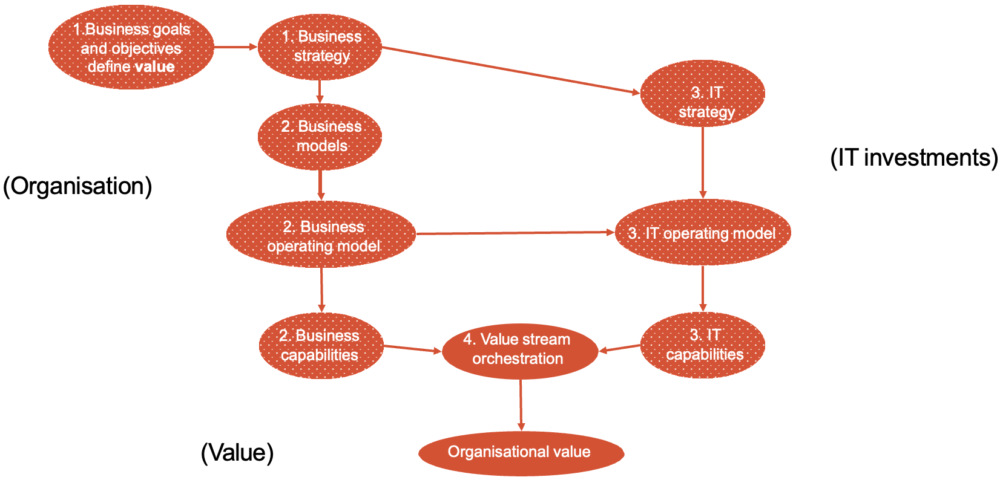
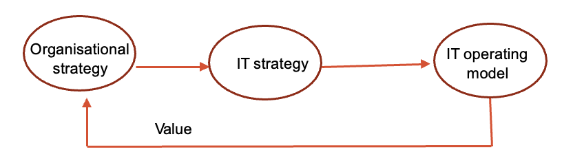

# Week 2
## Lecture

### Four Foundational Concepts
- Organizations (profit or non-profit)
  - Structure
    - top down
    - networked (e.g. Alibaba)
- Value
- Organizational Value
- IT Investments
  - **Resources** refer to what an organization owns. It can be tangible or intangible.
  - **Capabilities** refer to what the organization can do by using resources.
  - Resources and capabilities can be insourced or out sourced.
  - Organizations spend more investment in transformation can perform better financially than organizations with a similar investment. (Digital leader outperform laggards)

### How is that organizational value created

#### Organizational goals

Business goals define an endpoint, accomplishment, or targets an organization wants to achieve. (What)

Why are business goals important?
- It help measure progress (by providing milestones).
- It set the direction of a company.
- It establish accountability.
- It improve decision-making. (making sure the business moves to its target when making decisions)

#### Organizational Objectives and Strategy

Objectives specify the methods, paths and metrics that can help an organization achieve a goal. (How)

Strategy is a plan to achieve the goals and objectives. (More specific)

#### Business models

A business model is a description of how an organization creates, delivers, and captures value. It is based on the business strategy

Most organizations have more than one business model targeted at different customers.

Four basic components:
- Customers
- Value proposition
- Financial model
- Capabilities

#### Operating model

Operating model is the blueprint for how value will be created and delivered to stakeholders.

- How organization use their capabilities to create value.
- How organization manage itself.

Benefits:
- Effectiveness
- Efficiency
- Risk management
- Optimized performance

Any change to organization's business model will require changes to operating model.

#### IT Strategy

IT strategy is a part of organizational strategy. (What does IT need to do to create value for organization)

IT strategy is the plane for how the organizations IT investments will be applied to achieve the organizational goals and objectives.

#### IT Operating Model

How does It need to operate to sustain and extend the organization's strategy and how is IT governed?

#### IT Capabilities

#### Orchestrating business and IT capabilities into value streams

1. Identify the value stream and describe it on four standard elements (Name, Description, Stakeholder, Value).
2. Decompose it into a sequence of value-creating stages.

### How to Represent IT Value as Organizational Value

IT operational metrics (Technical) do not represent organizational value (Business).

Measured by its impact on organizational goals and objectives.
- Impact on revenue
- Customer value
- Shareholder value
- Operational efficiency
- Risk mitigation

## Reading

### [Information Technology and Business Alignment: Why it is Important:](https://www.techtarget.com/searchcio/feature/What-is-IT-business-alignment-and-why-is-it-important#:~:text=Why%20is%20IT%20business%20alignment,direction%20at%20the%20required%20speed.&text=%22Technology%20can%20be%20exciting%2C%20but,for%20purpose%20as%20originally%20hoped.)

IT-business alignment ensures that the IT organization and business units are working together and moving in the same direction at the required speed.

IT-business alignment helps ensure that the organization gets the right technology at the right time so it can meet its key performance indicators and reach its business transformation goals and objectives.
 
### [How CIOs prove business value](https://www.cio.com/article/221711/how-cios-prove-business-value.html)

### [Why Business Value is Key to IT Success](https://www.bmc.com/blogs/business-value-it)

#### Enterprise IT Value

Enterpise IT can creat
- Asset Value - hardware, software
- Business Value - overall impact on business model and service delivery
  - IT and productivity - automation
  - IT and forging competitive advantages
    - The ways the business can leverage new technology that puts them ahead of the competition
    - Presenting key metrics as they build a case for new investments
  - IT and customer satisfaction - keep customers happy and loyal

#### Measure Business Value of IT

When there is new technology investments, measuring the business value of IT is needed.

- Strategic value
  - Productivity enhancements
- Economic value
  - Reduce cost
  - Increase value