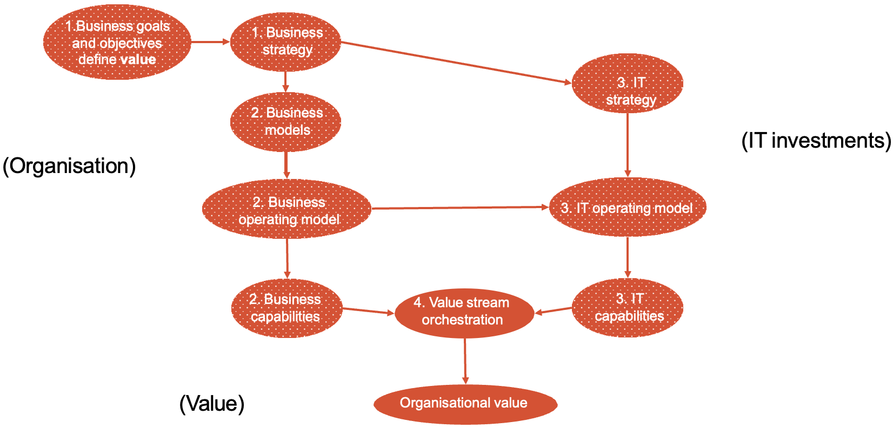

# Week 2
## Lecture

### Four Foundational Concepts
- Organizations (profit or non-profit)
  - Structure
    - top down
    - networked (e.g. Alibaba)
- Value
- Organizational Value
- IT Investments
  - **Resources** refer to what an organization owns. It can be tangible or intangible.
  - **Capabilities** refer to what the organization can do by using resources.
  - Resources and capabilities can be insourced or out sourced.
  - Organizations spend more investment in transformation can perform better financially than organizations with a similar investment. (Digital leader outperform laggards)

### How is that organizational value created

#### Organizational goals

Business goals define an endpoint, accomplishment, or targets an organization wants to achieve. (What)

Why are business goals important?
- It help measure progress (by providing milestones).
- It set the direction of a company.
- It establish accountability.
- It improve decision-making. (making sure the business moves to its target when making decisions)

#### Organizational Objectives and Strategy

Objectives specify the methods, paths and metrics that can help an organization achieve a goal. (How)

Strategy is a plan to achieve the goals and objectives. (More specific)

#### Business models

A business model is a description of how an organization creates, delivers, and captures value. It is based on the business strategy

Most organizations have more than one business model targeted at different customers.

Four basic components:
- Customers
- Value proposition
- Financial model
- Capabilities

#### Operating model

Operating model is the blueprint for how value will be created and delivered to stakeholders.

- How organization use their capabilities to create value.
- How organization manage itself.

Any change to organization's business model will require changes to operating model.

#### IT Strategy, IT Operating Model, IT Capabilities

IT strategy is the plane for how the organizations IT investments will be applied to achieve the organizational goals and objectives.

#### Orchestrating Business and IT Capabilities into Value Streams
