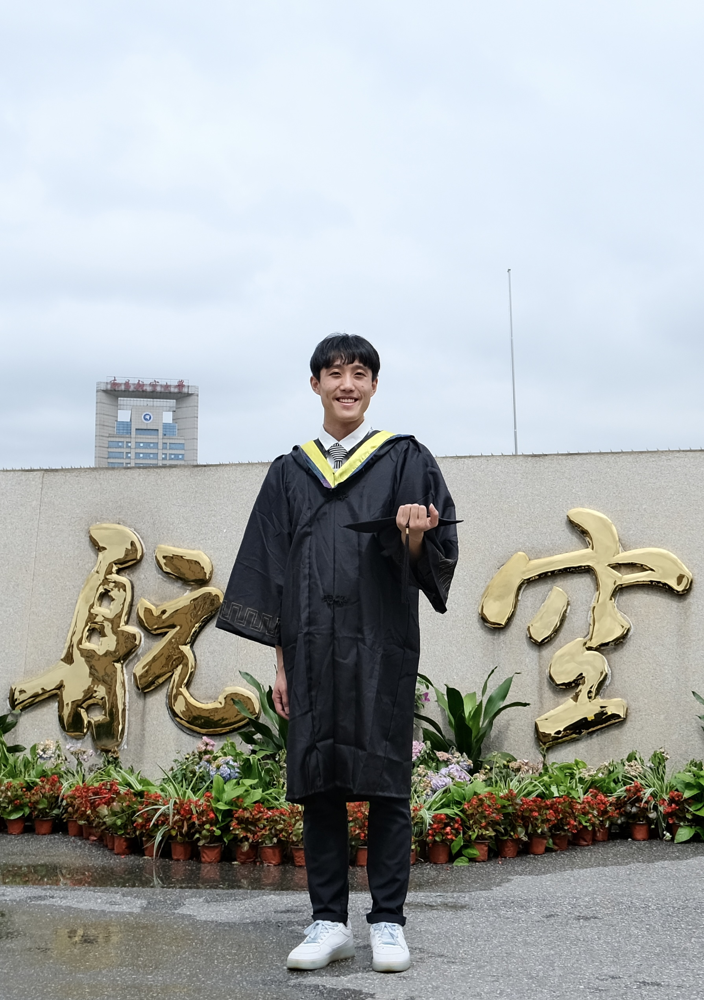

# About Me

 

Hay! Here is **Sicheng (Leo) Liu (刘思成)**.

I am currently a master's student studying Information Technology and Information Technology Management at the University of Sydney (USYD). I graduated from Nanchang Hangkong University (NCHU) in 2022 as an Outstanding Graduate, achieving a bachelor's degree in Software Engineering.

 

## Education

- **Aug 2022 - Present:** The University of Sydney - MEng, Information Technology & Information Technology Management
- **Sep 2018 - June 2022:** Nanchang Hangkong University - BEng, Software Engineering

 

---

## Research Interests

- Multimodal Summerization
- Natural Language Processing

My research interests include multimodal summerization and natural language processing. I'm currently doing research pathway supervised by A/Prof. Zhiyong Wang focusing on finding a better method combining information from different modal.

 

